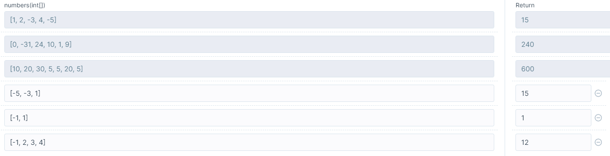

# 정규식 활용

### 숫자 체크

<pre class="language-javascript"><code class="lang-javascript">something.match(/\d/)
<strong>something.match(/[0-9]/)
</strong></code></pre>

### 숫자+영어소문자

```javascript
something.match(/[a-z0-9]/)
```

### 숫자+영어소문자+대문자

```javascript
something.match(/[a-zA-Z0-9]/)
```

### 영어소문자+대문자&#x20;

```javascript
something.match(/[A-z]/g)
```

### 문자열 시작 조건

```javascript
something.match(/^[A-Z]/)
```

**시작 조건**을 줄 때 `^` 를 앞에 붙여주면 된다.

위의 코드의 경우 문자열 시작이 영어 대문자로 시작한다는 의미이다.

### 자리수 제한

```javascript
/[0-9]{5,10}$/
```

\= (1) 숫자만 입력 가능하고, (2) 5\~10자리로 제한한다는 의미


### 추가 정규식

<figure><figcaption></figcaption></figure>

<figure><figcaption></figcaption></figure>


**참고**

[https://fabric004.tistory.com/20](https://fabric004.tistory.com/20)
